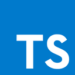
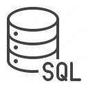

I am a software developer. Here are some of the things I'm interested in:

* C#
* ASP.NET
* .NET Core
* TypeScript
* PowerShell
* T-SQL
* Blazor
* VS Code
* Windows Terminal

📫 How to reach me: [christofjans@gmail.com](mailto:christofjans@gmail.com)

---

     

<!--
**christofjans/christofjans** is a ✨ _special_ ✨ repository because its `README.md` (this file) appears on your GitHub profile.

Here are some ideas to get you started:

- 🔭 I’m currently working on ...
- 🌱 I’m currently learning ...
- 👯 I’m looking to collaborate on ...
- 🤔 I’m looking for help with ...
- 💬 Ask me about ...
- 📫 How to reach me: ...
- 😄 Pronouns: ...
- ⚡ Fun fact: ...
-->
